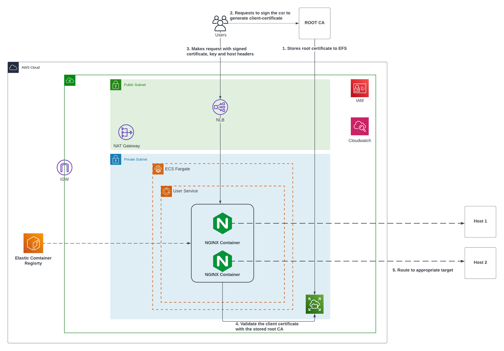

# SSL Certificate Validation through ECS Fargate (Nginx)

# Problem Statement
- The challenge is to implement SSL validation for clients routed through an Amazon Network Load Balancer (NLB).
- SSL termination is not performed within the NLB layer; instead, SSL validation is handled through Amazon ECS Fargate with Nginx as an intermediary component.

# Infrastructure

## Components
- VPC with Public and Private Subnets
- NAT Gateway
- Network Load Balancer (NLB)
- ECR
- ECS Fargate
- NGINX Containers
- Elastic File System (EFS)
- IAM
- S3

## Terraform commands

**Step 1 :** The `stager` directory contains the pre-requisite resources for our ECS components. Mainly the VPC, Lambda, EFS and S3. Run the following commands:

```sh
cd stager
terraform init
terraform plan
terraform apply --var-file=dev.tfvars
```

**Step 2 :**. Run the GitHub Actions workflow (see Workflow Description below for details) - This shall only be run when there's need to generate SSL certficates for Server and Root CA automatically. If you are using your own server certificate and Root CA, upload those directly to the bucket created by `s3_bucket_for_server_configs` module.

**Step 3 :**. After that navigate to the `main` directory which contains our main ECS components that performs the SSL Validation and the NLB. Run the following commandsL

```sh
cd main
terraform init
terraform plan
terraform apply --var-file=dev.tfvars
```

**NOTE:**  Terraform backend is provisioned with S3 bucket to maintain state files which needs to be configured prior to performing above commands. Update the `backend.tf` file inide both `main` and `stage` directories with necessary bucket name and key accordingly.


# Workflow Description (Server Configs and Certificates to S3)

 GitHub Action workflow is used to automatically create and store the Root CA (self-signed),Server SSL certificates as well as Nginx configuration into the AWS S3 bucket.

The pipline with use the bash script stored in `scripts` to generate the SSL certificates, while the Nginx configuration file will be generated inside the pipeline itself.

## Prerequisites

- Pre-configured S3 bucket to store the generated certificate **(Complete Step 3 from Terraform Commands above)**
- Common Name and email address for server and root-ca stored in GitHub Actions Secrets of this repository to create the certificates. (See Secrets Names Below)

## Jobs Involved

- An event will trigger the worflow. This  Select the Workflow file from Actions Tab and run it whenever needed.

    > **Note:** The trigger branch can be created if required to start the workflow based on events in certain branch. Check comments in `certificates-config-generation.yaml` for the example.

- Permissions are set up for OIDC verification in GitHub Action runner.

    > **Note:** Runner are the OS type on which the pipeline is executed. We are using ubuntu 22.04.

- Variables are defined in `env` section of the pipeline.

- The jobs section of the pipeline involves following tasks:

    `1. Checkout the code:` We are fetching the code from stage branch.

    `2. Configure AWS Credentials:` Configuring OIDC for AWS credentials.

    `3. Fetch the data from github secrets:` Fetching the value stored in github secrets for certificate generation.

    `4. Create server/root_ca certificate:` Creating server and CA certificate using the data from parameter store and bash script

    `5. Copy server/root_ca certificate to S3:` Copying the certificate from Github Action runner to s3 bucket

    `6. Create  file:` Creating Nginx configuration file in pipeline

    `7. Copy the conf file to s3:` Finally we copy the configuration file of Nginx to s3 bucket`

## Secrets and Example Usage

List of secrets used in the pipeline with their usage.

| Secret Name | Value |
---|---
POC_ACC | Account ID of the AWS account you are working on
SERVER_PARAMETER_VALUE | value to create server side certificate
ROOT_CA_PARAMETER_VALUE | value to create root ca certificate
SERVER_SUPPLIED_CRT_FILE | server side certificate
SERVER_SUPPLIED_PRIVATE_KEY | server side private key
PATH_OF_EFS_FOR_CLIENT_CERTIFICATE_CA | client certificate stored in AWS EFS
ip_or_dns_for_backend | backend dns or ip that user is targeting

> **Info:** The path of the certificate files should be explicitly defined in the Github Secrets.

`Usage: ` /etc/nginx/efs-mount/server/server.crt
    `the directory that we have created inside the nginx directory can be created anywhere per requirements.`

    - After creating the custom directory and adding certificate to the path we must specify the same path in nginx configuration.

    - Similarly the path for the private key and client certificate must be defined by user in github secrets.

    - It is better to use same directory structure for all of the certificates.

    - Only vary the path of certificate inside same directories if the certificate are for different purpose.


# TEST: Validate the project

## 1. Create Client Key and Certificate Signing Request (csr)
```sh
openssl genpkey -algorithm RSA -out client-key.pem
openssl req -new -key client-key.pem -out client-csr.pem
```

## 2. Submit CSR to our Root Certificate and generate Client Certificate
**Important:** You need to use the client certificate that is signed by root CA that we generated in the workflow i.e the one stored in s3 bucket with output value of `s3_id` from stager directory . Download the root-ca certificate and key file from there and run the following commands
```sh
openssl x509 -req -in client-csr.pem -CA root-ca-cert-file.crt -CAkey root-ca--key-file.key -CAcreateserial -out client-certificate.crt -days 365
```

# Test : Command to validate the project
You can use this command on your local machine (client). We have used the --insecure flag as this is a self-signed CA.

```sh
curl --insecure --cert client-certificate.crt --key client-key.pem NLB-DNS:PORT
```


# Certficate Generation Steps (Local)

## 1. Create a Private Key for Root CA
```sh
openssl genpkey -algorithm RSA -out root-ca.key
```

## 2. Create Root Certificate with with generated private key
```sh
openssl req -x509 -new -nodes -key root-ca.key -days 365 -out root-ca.crt
```
> Remember to give appropriate Common Name and Email

## 2. Create Server Certification and Server Key
```sh
openssl genpkey -algorithm RSA -out server-key.pem
openssl req -x509 -nodes -newkey rsa:2048 -keyout server-key.pem -out server-cert.pem -days 365
```
